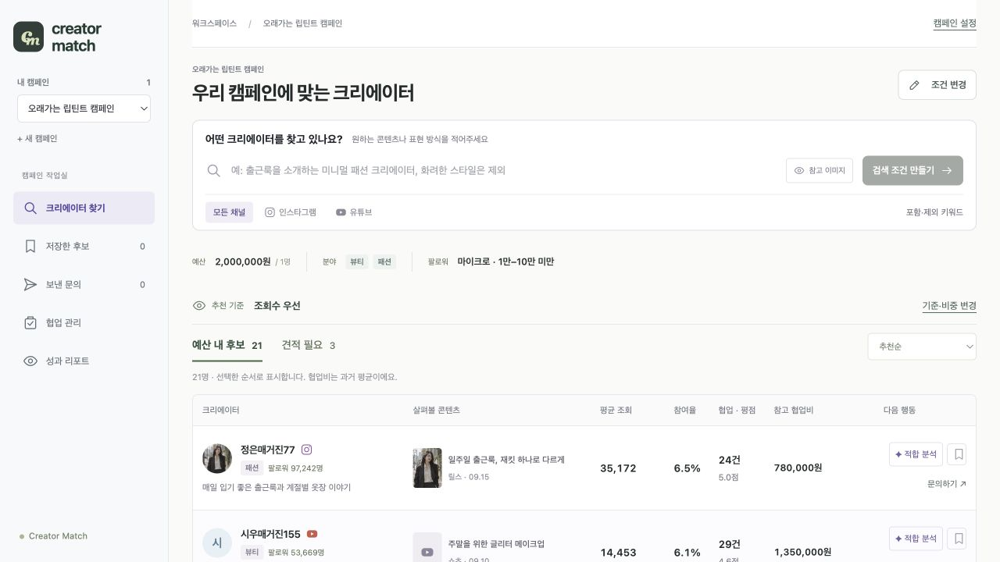

# Creator Match

**브랜드 마케터가 조건에 맞는 크리에이터를 추리고, 누구를 먼저 검토할지 설명할 수 있게 하는 매칭 웹앱입니다.**

한 명당 200만 원으로 립틴트 협업 후보를 찾는 상황을 가정했습니다. 조회가 강한 후보와 반응이 강한 후보가 다를 때, 사용자의 우선순위를 결과에 반영합니다. 과거 비용을 모르는 사람은 별도로 남겨 견적을 확인하게 합니다.



## 기획의 핵심

조건 적합, 검토 순서, 콘텐츠 활용 판단을 구분했습니다. 예산·분야·규모는 자격을 정하고, 참여율·조회수·평점·경험은 순서를 정합니다. 제품·고객 맥락과 콘텐츠는 그 후보를 어떻게 활용할지 검토하는 데 씁니다.

이 구분이 필요한 이유는 모든 정보를 하나의 ‘적합 점수’로 합치면, 왜 탈락했는지와 무엇이 미확인인지가 흐려지기 때문입니다. 후보별 설명·비중 조절·견적 필요 영역·문의 질문은 이 판단을 사용자가 확인하는 장치입니다.

기획의 출발점과 검증 전 가설은 [PRD §1–2](PRD.md#1-과제를-제품-문제로-정의하기), 추천 설계는 [PRD §4](PRD.md#4-추천-로직을-선택한-이유)에 있습니다. 사용자 인터뷰로 문제의 크기를 입증한 결과물은 아닙니다.

## 로컬 실행

Node.js **22.12 이상**과 npm이 필요합니다. 로그인·API 키·데이터베이스 없이 기본 경로를 실행할 수 있습니다.

```sh
npm ci
npm run dev
```

실행 후 **[프로토타입 열기](http://127.0.0.1:5173/?demo)**를 선택합니다. 실행한 컴퓨터에서만 열리는 로컬 주소이며 공유 호스팅 주소가 아닙니다. 다른 포트가 표시되면 해당 주소에 `?demo`를 붙입니다. HTML 파일을 직접 여는 방식은 지원하지 않습니다.

일반 경로는 localStorage에 캠페인을 보관합니다. `?demo`는 별도 sessionStorage를 사용합니다. 미확정 온보딩 입력은 새로고침으로 사라질 수 있습니다.

## 세 장면으로 검토하기

1. **조건 확인:** ‘예시 문장 넣기 → 캠페인 초안 만들기’ 후 캠페인·고객 → 후보 조건 → 추천 기준을 확인합니다. 뷰티·패션 / 마이크로 / 1명당 200만 원을 적용하면 예산 내 21명, 견적 필요 3명이 나옵니다.
2. **선택 기준 변경:** 조회수 우선의 첫 후보는 정은매거진77입니다. ‘기준·비중 변경 → 참여율 우선’을 적용하면 서연리뷰66이 먼저 나옵니다. 같은 후보 집합에서 검토 순서가 달라집니다. [두 후보의 계산과 해석](PRD.md#42-실제-사례로-읽는-추천)
3. **빈 결과 복구:** 예산을 1원으로 낮추면 예산 내 후보가 없습니다. 제시된 540,000원을 직접 적용하면 소라TV177 한 명이 나옵니다. 미확인 비용 후보는 견적 필요 영역에 남습니다.

선택 기능은 ‘민준브이로그180 → 적합 분석 → 근거 확인 → 제안 담아 문의하기’로 확인할 수 있습니다. 이 후보의 콘텐츠·댓글은 별도 편집 예시입니다. 문의·협업·성과 기록은 로컬 동작이며 실제 이메일·DM을 발송하지 않습니다.

## 추천 설계와 감수한 한계

| 결정 | 이유 | 감수한 한계 |
|---|---|---|
| 조건과 점수 분리 | 분야 일치·싼 가격·큰 규모의 중복 가산 방지 | 여러 명의 총예산 최적화는 해결하지 않음 |
| 참여·조회는 플랫폼×규모 내 상대 위치 | 비교 맥락을 밝히고 절대 크기의 지배 완화 | 절대 차이가 압축되고 기간·형식·분야 차이는 남음 |
| 평점 척도 환산·경험 로그 환산 | 평점 의미 유지, 경험 추가 가산 완화 | 응답 수와 성공한 집행인지 알 수 없음 |
| 목적별 시작 비중·사용자 조절 | 하나의 비중을 모든 사용자의 정답으로 고정하지 않음 | 비중은 학습한 최적값이 아닌 제품 가정 |
| 비용 미확인 별도 처리 | 0원을 무료로 오해하지 않고 후보 보존 | 실제 견적 전에는 예산 적합을 알 수 없음 |

조회수 우선의 참여·조회·평점·경험 비중은 20/55/15/10%, 반응은 50/25/15/10%, 협업 이력은 20/20/30/30%, 균등은 25%씩입니다. 목표가 구매여도 전환 예측을 하지 않으며 균등 비교로 시작합니다. 비중·결측·동점·예외의 정확한 정책은 [PRD §4](PRD.md#4-추천-로직을-선택한-이유)를 따릅니다.

원본 200명 중 27명은 이력 0·평균 비용 0·평점 공란입니다. 미평가로 표시하고 점수 순위에 섞지 않습니다. 이력 있는 173명의 평균 비용×건수와 누적액 불일치는 수정하지 않고, 예산 필터에 제공 평균값을 사용합니다. 원본 SHA-256과 11개 필드 사용처는 [데이터 감사](docs/DATA_AUDIT.md)에 있습니다.

## 검증과 재현

```sh
npm run check       # 자동 테스트 + 타입 검사 + 빌드
npm run preview     # 빌드 결과 확인
npm run analyze     # 데이터 감사·대안·비중 비교 재생성
node --import tsx scripts/review-logic.ts
```

macOS / Node25.5.0 / npm11.8.0에서 자동 테스트 200개·타입 검사·빌드를 통과했습니다. 별도 빈 폴더에서 기존 npm 캐시를 이용한 설치도 확인했습니다. 새 OS·캐시 없는 환경의 검증과는 다릅니다.

같은 자격 조건으로 A=팔로워순, B=전체 집단 환산, C=플랫폼×규모 환산을 비교했습니다. 150조건 중 후보가 있는 76조건에서 C의 조건 위반 0건, A–C의 1위 차이 45건을 확인했습니다. **순위가 달라진다는 증거이며 추천 정확도·매출 개선의 증거는 아닙니다.** [실험](docs/EVALUATION.md)

가설 검증은 별도입니다. 사용자가 선택 이유와 미확인 정보를 설명할 수 있는지 시험할 계획이며 실제 사용자 테스트는 아직 하지 않았습니다. [검증 범위·남은 공백](docs/QA.md)

## 제품 내부 AI와 확장 범위

온보딩 정리·문의 문안·성과 요약은 현재 로컬 규칙입니다. 검색·후보 분석에는 선택적 서버 모델 경로가 있지만 실제 모델 응답 품질·비용·지연은 이번 환경에서 검증하지 않았습니다. 모델을 연결해도 추천 점수와 필터는 규칙으로 유지합니다.

선택적 연결은 `.env.example`의 서버 환경변수를 사용합니다. 키를 공개하거나 `VITE_` 변수에 넣지 않습니다. 정적 호스팅에는 로컬 서버 경로가 자동으로 포함되지 않습니다.

콘텐츠 예시 5명과 AI 생성 이미지 2개는 원본 CSV와 구분하고 점수에 가산하지 않습니다. 실제 SNS 자동 수집·발송·회원가입·결제·공동 편집·모바일 작업은 제외했습니다. 성과는 캠페인별 최신 수동 기록이며 추천 학습으로 환류하지 않습니다.

## 제출 문서

| 문서 | 역할 |
|---|---|
| [PRD.md](PRD.md) | 과제·문제·근거·가설 → 해결 선택 → 추천 근거 → 스토리별 디자인/데이터/개발/AI → 검증·미결정 |
| [flowchart.md](flowchart.md) | 입력부터 결과까지 조건 분기·예외 복구·선택 업무 경로 |
| [AI_USAGE.md](AI_USAGE.md) | 실제 프롬프트·컨텍스트·지원자의 수정 판단·AI 수행·검증 |
| [화면·데이터·개발 상세](docs/PRODUCT_SPEC.md) | S00–S10의 필드·상태와 AC01–13의 구현 계약 |
| [요구사항 추적표](docs/REQUIREMENTS.md) | 원문 요구별 구현·문서·검증 증거 |
| [자료 안내](docs/README.md) | 현재 근거와 과거 결정 이력의 구분 |

경쟁사에서는 UI 자체보다 비교·근거 확인·협업 연결을 참고했습니다. 이번 차별화의 초점은 제공 데이터의 한계를 실제 정책·화면·검증에 일관되게 반영하는 것입니다. 경쟁사에 없는 독점 기능을 주장하지 않습니다. [경쟁사 조사](docs/COMPETITOR_DEEP_DIVE.md)

작업 커밋은 squash하지 않았습니다. 원문 PDF·채용 메일·인증 정보는 저장소에서 제외합니다. [공개 저장소](https://github.com/vk2commits/creator-match)의 비로그인 접근, 필수 문서와 CSV, GitHub의 Mermaid 7개 렌더링을 확인했습니다. 이메일 제출은 별도이며 아직 발송하지 않았습니다.
