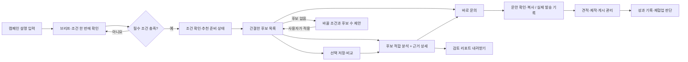

# 경쟁사 벤치마크 적용 계획 — 후보를 찾는 화면에서 협업을 결정하는 흐름으로

작성·출처 재확인: 2026-09-22. 상태: **전체 개선 계획 + 두 차례 적용**. 전체 구현 완료나 사용자 검증 결과가 아니다. [1차 분석·근거·문의 연결](UNIFIED_ANALYSIS.md), [2차 온보딩 축소·입력 보존·캠페인 분리 검증](ONBOARDING_REVIEW.md)을 적용했다. 검색의 자료 미확인 분리와 목록 정리는 아직 남아 있다.

[Notion에서 보기](https://app.notion.com/p/3e3e0a6c573781b9a14fde4378904740)

기반: [경쟁사 심층 보고서](COMPETITOR_DEEP_DIVE.md), 현재 로컬 코드, 데스크톱 온보딩·추천 목록 직접 확인. 공식 제품 설명과 도움말을 근거로 삼았으며 경쟁사의 유료 계정을 직접 사용한 비교 실험은 아니다. 가격이나 기능의 우열을 새로 검증한 문서도 아니다.

## 1. 우리가 만들 경험과 우선순위

**브랜드 실무 마케터가 “우리 제품을 누구에게, 어떤 내용으로 맡길지” 결정하고 바로 문의할 수 있는 캠페인 작업실.**

벤치마크는 여섯 서비스의 기능을 모두 모으는 작업이 아니다. 다음 세 가지 연결을 우선 완성한다.

1. 내가 입력한 제품·타깃·표현 방향이 검색 조건과 후보 분석에 실제로 반영된다.
2. 분석 문단의 이유를 누르면 해당 콘텐츠·댓글·지표를 확인할 수 있다.
3. 분석에서 발견한 확인 사항과 제작 제안이 문의 문안으로 이어진다.

추천 로직의 설계 근거와 기획 문서화라는 과제 평가 축에 가장 직접적으로 기여하는 부분이다. 운영·성과 기능은 이 선정 판단을 끝까지 보여주는 짧은 후속 흐름으로 둔다. 모바일, 실제 결제, 조직 권한, 대규모 CRM, 자동 SNS 수집은 이번 개선 범위에 추가하지 않는다.

### 계획 작성 당시 상태와 개선 방향

| 현재 확인한 상태 | 마케터 입장에서 남는 문제 | 이번 계획 |
|---|---|---|
| AI 초안 → 타깃 → 조건 → 비중의 4단계, 결과 전 로딩 있음 | 이미 문장에 적은 조건도 여러 화면에서 다시 확인 | 초안과 추출 조건을 한 화면에서 검토, 부족한 항목만 보완 |
| 예산 쉼표, 직접 비중 슬라이더·숫자 입력 있음 | 비중을 바꾸면 누구를 더 먼저 보게 되는지 알기 어려움 | 비중 편집 안에 상위 후보 변화와 이유 제시, 적용·취소 유지 |
| 작은 적합 분석 버튼과 가로형 후보 목록 있음 | 상단 검색·조건 영역이 크고, 작은 글씨·반복 설명이 많음 | 검색 영역 축소, 태그 정리, 주요 숫자와 행동의 가독성 보강 |
| 적합 분석, 콘텐츠 분석, 분석 리포트가 나뉘어 있음 | 비슷한 분석을 어디서 읽고 다시 생성해야 하는지 혼란 | 후보 상세 한 곳에서 요약 → 근거 → 문의로 연결 |
| 자연어·포함/제외 키워드·이미지 입력 관련 코드 있음 | 일부 후보만 콘텐츠 자료가 있어 검색 누락이 불일치로 보일 수 있음 | 자료 있음/확인 필요를 구분하고 검색 범위·결과 수를 일치시킴 |
| 캠페인 전환·콘텐츠/댓글 등록·브랜드/오디언스 탭 관련 코드 있음 | 파일이 있다는 것만으로 상태 보존·근거 일치까지 검증된 것은 아님 | 재구축하지 않고 연결·빈 상태·기존 기록 보존을 우선 검증 |
| 원본 200명, 추가 콘텐츠 예시 5명 | 5명의 사례만 보고 200명을 모두 심층 분석했다고 오해 가능 | 원본 지표와 별도 예시 자료의 범위·출처를 구분 |

위 상태 중 온보딩·로딩·목록·비중 입력은 이번 브라우저 확인에 근거한다. 캠페인별 저장·수집·리포트의 완전한 동작은 이번 계획 작업에서 다시 검증하지 않았다. 기존 PRD는 10차 기준이므로 개발 중 코드와 달라진 부분은 후속 구현 확정 후 동기화한다.

## 2. 경쟁사별 상세 적용안

### REVU → 제품을 이해하는 온보딩

**확인한 방식:** 맞춤 섭외에서 목표·브랜드 방향·크리에이터 스타일·필수 노출 요소를 받고, 후보 제안·운영·결과 보고로 이어진다. [공식 캐스팅 안내](https://biz.revu.net/casting)

**R-01. 캠페인 설명 한 번 → 편집 가능한 브리프**

- 진입: 새 캠페인. “어떤 제품을 누구에게 소개하고 싶나요?”라는 질문 하나로 시작한다.
- 입력 예: “출근 준비가 바쁜 직장인에게 지속력 좋은 틴트를 알리고 싶어요. 자연스러운 사용 장면이면 좋겠고, 1명당 200만 원까지예요.”
- 결과: 제품, 고객, 목표, 원하는 표현, 예산을 추출한 초안. 사용자가 적은 값과 AI가 제안한 값을 구분한다. 근거 없이 ‘비교 리뷰’ 같은 스타일을 확정하지 않는다.
- 이미 적은 예산·타깃을 다시 입력시키지 않는다. 분야·팔로워 규모 등 필수 조건이 비어 있을 때만 해당 필드에 질문한다. 캠페인명은 초안에서 수정할 수 있게 한다.
- 타깃이 미정이면 “아직 정하지 않았어요”로 진행할 수 있다. 이때 분석이 특정 고객층을 만들어내지 않는다.
- 수용 기준: 자연어에 넣은 예산·타깃이 검토 화면과 결과에 일치하며, 잘못 추출한 항목을 개별 수정해도 다른 입력을 잃지 않는다.

**R-02. 결과를 바꾸는 질문만, 필요한 시점에**

| 질문 | 묻는 시점 | 답을 사용하는 곳 |
|---|---|---|
| 제품·알릴 점 / 목표 | 처음, 필수 | 분석 요약·콘텐츠 제안·성과 기본 지표 |
| 1명당 예산 / 분야 / 팔로워 규모 | 추천 전, 필수 | 후보 자격 판정 |
| 고객 / 제품을 고를 때 중요한 점 | 브리프 검토, 선택 | 제품과 사용 장면의 연결 |
| 원하는 스타일 / 피할 표현 | 브리프 검토, 선택 | 검색 키워드 제안·표현 방향 비교 |
| 반드시 담을 내용 | 선택 입력 | 제작 제안·문의·게시 후 확인 |
| 제작 형식·수량 / 일정 / 사용권 | 문의 직전 | 문의 초안과 견적 비교 |
| 클릭·구매의 측정 방식 | 구매 목표 선택 시 선택 안내, 결과 기록 시 구체화 | 성과 해석과 귀속 기준 |

추가 질문을 넣으려면 “이 답이 어떤 결과를 바꾸는가?”를 문서에 연결한다. 입력만 받고 쓰지 않는 브랜드 철학·긴 설문·가입 정보는 제외한다.

**R-03. 필수 노출 요소를 다음 업무까지 재사용**

예를 들어 ‘자연광 발색’과 ‘식사 후 지속력’을 적었다면 분석의 제작 방향, 문의 문안, 게시 후 체크리스트에 같은 내용이 이어져야 한다. 콘텐츠 제작 가능 여부가 확인되지 않았다면 이미 가능한 것처럼 추천하지 않고 문의 항목으로 남긴다.

우선순위: R-01·02는 P0, 게시 후 확인까지의 확장은 P1. 운영 대행·다채널 모집 상품 전체는 복제하지 않는다.

### Modash → 원하는 모습을 찾고 캠페인 안에서 이어가기

**확인한 방식:** 자연어·이미지 입력을 소개글·캡션·비주얼 탐색에 사용하고, 브랜드 협업 이력과 관계 상태를 제공한다. 상태 변경은 수동이며 관계 상태와 캠페인 추적이 별도로 관리된다고 도움말에 설명한다. [Discovery](https://www.modash.io/features/influencer-discovery), [상태 관리 도움말](https://help.modash.io/en/articles/13715187-managing-creator-relationships-and-statuses)

**M-01. 자연어를 사용자가 고칠 수 있는 검색 조건으로 변환**

- 예: “미니멀 출근룩, 화려한 스타일 제외” → 포함 `출근룩` `미니멀`, 제외 `화려한`.
- 초안의 태그를 삭제·추가·편집한 뒤 적용한다. 후보가 없다고 AI가 예산·분야를 몰래 바꾸지 않는다.
- 검색된 이유는 `소개에서 확인` 또는 `콘텐츠에서 확인`으로 연결한다. 키워드 일치가 곧 캠페인 적합 판정은 아니다.
- 현재 포함 키워드는 OR 방식이다. ‘뷰티 또는 직장인’처럼 넓어지는 조합을 막기 위해 콘텐츠 주제와 스타일을 구분하는 개선을 검토한다. 상세 검색에서 ‘하나 이상 포함/모두 포함’을 선택하게 하되 기본 화면에는 문법 설명을 늘어놓지 않는다.
- 직접 쓴 키워드도 입력 가능해야 한다. 추천 태그만 선택할 수 있는 폐쇄적인 목록으로 만들지 않는다.
- 수용 기준: 제외 조건 우선 적용, 한글 입력 중 Enter 오작동 방지, 적용 전 변경 없음, 해제 후 정확한 후보 수 복구.

**M-02. 이미지 검색은 보조 입력**

‘이런 느낌의 콘텐츠’라는 참고 이미지를 넣고 확인된 표현 특징을 태그로 제안한다. 색감만 분석한 결과를 인물·상황·콘텐츠 맥락까지 이해한 것으로 표현하지 않는다. 현재 로컬 색감 추출과 실제 멀티모달 분석을 문서에서 구분한다. 의미 기반 이미지 검색의 전체 검증은 P1이며 P0를 지연시키지 않는다.

**M-03. 캠페인마다 독립된 후보·협업 기록**

- 같은 크리에이터도 캠페인 A에서는 ‘견적 확인’, B에서는 ‘제작 중’일 수 있다.
- 현재 캠페인의 저장·문의·비용·결과는 분리하고, 공개 채널 자료는 공통으로 참조한다.
- 캠페인 선택 위치를 고정하고 전환 후 캠페인명·조건·후보·문의 내역이 함께 바뀌어야 한다.
- 상태 변경 때 다음 행동을 보여준다. ‘문의함’이면 답변 기록, ‘견적 받음’이면 조건 비교, ‘게시 완료’면 성과 입력이다. 자동으로 답변을 받은 것처럼 상태를 이동하지 않는다.
- 저장 후 비교를 강제하지 않는다. 마음에 드는 한 명에게 즉시 문의할 수 있다.
- 수용 기준: 두 캠페인에서 같은 후보를 다르게 기록하고 전환·새로고침해도 섞이지 않는다.

우선순위: M-01·03은 P0 연결 검증, M-02는 P1. 닮은 채널 검색·자사 팔로워 탐색·고객 이메일 연동은 추가 데이터가 필요한 후속 항목이다.

### 피처링 → 채널 인기와 광고에서의 제품 반응 구분

**확인한 방식:** 포함·제외 검색, 광고 게시물 분석, 댓글 반응, 협업 브랜드 이력, 캠페인 결과 보고를 제공한다고 설명한다. [검색](https://featuring.co/product-search), [분석](https://featuring.co/product-analysis), [결과 리포트](https://featuring.co/product-campaign-result-report)

**F-01. 콘텐츠와 광고 반응을 다른 질문으로 보여주기**

- 콘텐츠 탭의 질문: “어떤 방식으로 제품을 보여주나요?”
- 광고 반응 탭의 질문: “광고에서도 제품에 질문하나요?”
- 광고/일반 콘텐츠를 분리하고 각 평균 옆에 사용한 게시물 수·기간을 표시한다. 형식·게시 후 경과 기간이 다르면 직접적인 우열 판정을 하지 않는다.
- 원본 CSV의 평균 조회수와 추가 게시물의 평균은 범위가 다르다. 서로 덮어쓰거나 한 그래프에서 동일한 모집단처럼 합치지 않는다.
- 현재 5명 예시의 데이터를 활용해 흐름을 검증하되, 이를 실제 수집이나 200명 전체 커버리지로 표현하지 않는다.

**F-02. 댓글 수보다 ‘무엇을 궁금해했는가’**

- 첫 요약은 “발색과 지속력에 관한 질문이 있어 사용 과정을 설명하는 구성을 검토할 만합니다”처럼 제작 판단으로 연결한다. 실제 댓글이 이를 뒷받침할 때만 표시한다.
- 아래에는 제품 질문·구매 의향·불만의 원문 근거와 집계 분모를 둔다. 구매 의향과 감정은 별개 분류이며 한 댓글에 동시에 나타날 수 있다.
- 예: 제품 질문 5개 / 검토 댓글 13개. 전체 댓글을 전부 분석한 것처럼 백분율을 쓰지 않는다. 표본이 적다면 개수와 사례를 우선한다.
- AI 분류는 수정 가능하고 미분류는 0개 반응으로 간주하지 않는다. 구매 의향을 실제 구매·전환으로 바꾸지 않는다.
- 수용 기준: 요약이 인용한 댓글을 열 수 있고, 분류를 바꾸면 관련 집계도 일치한다. 자료 없음과 반응 없음이 다르게 보인다.

**F-03. 브랜드 이력에서 문의할 내용을 만들기**

브랜드·게시일·형식·광고 표기를 타임라인으로 보여준다. 같은 업종 사례는 참고 자료다. 경쟁 브랜드 협업을 발견해도 자동 탈락시키지 않고, 기간·독점 여부를 확인할 질문으로 연결한다. 과거 사례가 있다는 이유만으로 계약 충돌을 확정하지 않는다.

우선순위: F-01·02는 기존 상세 구조를 보강하는 P1. F-03의 자료 표시·문의 연결은 간단한 범위에서 P1. 자동 댓글 수집, 실시간 모니터링, 광고 성과 예측은 이번 과제의 완성 조건으로 추가하지 않는다.

### HypeAuditor → ‘콘텐츠가 맞음’과 ‘시청자가 맞음’을 분리

**확인한 방식:** Audience Fit은 설정한 지역·연령·성별에 해당하는 오디언스를 기준으로 설명한다. Audience Brand Affinity는 오디언스의 브랜드 콘텐츠 반응을 보는 별도 개념이다. [Audience Fit 도움말](https://help.hypeauditor.com/en/articles/6615552-what-is-the-audience-fit-based-on), [Brand Affinity 도움말](https://help.hypeauditor.com/en/articles/5925902-what-is-audience-brand-affinity)

**H-01. 캠페인 적합 분석에 서로 다른 두 판단을 담기**

- 콘텐츠 연결: 실제 게시물에서 우리 제품을 어떤 사용 장면으로 소개할 수 있는가.
- 고객 도달 근거: 그 채널의 시청자가 우리가 원하는 고객과 얼마나 겹치는가.
- 첫 번째가 좋아도 두 번째가 미확인일 수 있다. 둘을 하나의 ‘적합도 94%’로 합치지 않는다.
- 예: “출근 준비 콘텐츠와 제품의 사용 장면은 연결됩니다. 실제 시청자의 직업은 확인되지 않아 최근 채널 인사이트를 받아보는 것이 좋습니다.”

**H-02. 자료가 없으면 다음 확인으로 연결**

연령 자료가 있어도 ‘25~34세=직장인’이라고 추정하지 않는다. 연령·성별·지역의 개별 비율을 곱해 결합 타깃 비율을 만들지 않는다. 자료의 측정일·대상·출처를 함께 보여주고, 없으면 “타깃 확인용 인사이트 요청”을 문의 초안에 추가한다. 모든 후보에게 같은 주의사항을 반복하는 대신 실제로 부족한 자료만 요청한다.

**H-03. 상세 정보의 양이 적합성 점수가 되지 않게 하기**

원본에 콘텐츠·오디언스가 없는 후보는 ‘부적합’이 아니다. ‘자료 확인 필요’로 유지한다. 검색에서 명백히 조건이 다른 후보와 확인할 자료가 없는 후보를 분리한다. 자료를 많이 가진 5명만 자동으로 상위에 올리지 않는다.

우선순위: 이 세 가지 판단 규칙은 P0. 정교한 오디언스 차트·품질 점수는 P2이며 원본 데이터로 만들 수 없다.

### CreatorIQ → 콘텐츠를 먼저 보고, 판단 근거로 돌아가기

**확인한 방식:** 검색 결과에서 게시물을 보며 콘텐츠 스타일을 검토하게 한다. SafeIQ는 AI가 발견한 이슈의 맥락·요약·검토 위치를 제시한다고 설명한다. [Creator Discovery](https://www.creatoriq.com/influencer-marketing-solution/creator-search), [SafeIQ](https://www.creatoriq.com/brand-safety)

**C-01. 간결한 목록과 의미 있는 미리보기**

- 가로형 행을 유지한다. 이름·플랫폼·분야 / 관련 콘텐츠 1~2개 / 핵심 지표 / 참고 협업비 / 행동 순서다.
- 썸네일은 장식용 얼굴을 반복하지 않고 검색어와 관련된 게시물을 우선한다. 관련 자료가 없으면 억지 이미지를 채우지 않는다.
- 현재 같은 이미지가 여러 게시물에 반복되는 부분은 정보성이 떨어진다. 게시물별 표현이 실제 자료와 맞는지 먼저 점검한다.
- 필수 원지표는 상세에서 모두 접근 가능하게 유지한다. 목록에는 숫자 설명을 매 행마다 반복하지 않고 열 제목으로 안내한다.
- `적합 분석`은 저장과 나란한 작은 버튼, `문의하기`는 바로 이어지는 행동으로 유지한다. 행 전체가 강제 분석 버튼이 되지 않게 한다.

**C-02. AI 분석의 첫 문단과 근거를 한곳에**

후보 상세의 첫 화면은 3~4문장으로 읽을 수 있어야 한다. ‘이 후보의 표현 방식 → 내 제품·고객의 필요 → 제안할 콘텐츠 → 조율·확인할 점’ 순서다. 문장 아래 작은 근거 링크를 누르면 해당 게시물·댓글·원지표가 열린다. 일반적인 긍정 문장으로 모든 후보를 칭찬하지 않는다.

현재 ‘적합 분석’과 별도의 ‘분석 리포트 생성’을 하나의 분석 결과로 통합한다. 상세 탭은 그 결과를 확인하는 근거이고, 내보내기는 지금 보고 있는 분석의 다운로드여야 한다. 다른 문장을 다시 생성해 화면과 리포트가 충돌하지 않게 한다.

**C-03. AI 결과를 정정하고 다시 쓰기**

“우리 제품은 이 표현과 달라요” 또는 “이 근거는 제외할게요”를 입력하면 사용자가 확정한 브리프와 확인된 근거 범위 안에서 설명·문의 제안을 갱신한다. 정정이 곧 추천 수식의 자동 학습이나 전체 순위 변경은 아니다. 변경 범위를 보여준다.

우선순위: C-01·02는 P0. C-03의 자유 대화는 P2, 작은 ‘다시 분석’과 근거 오류 신고는 P1. 브랜드 위험 점수·영상 자동 감시를 복제하지 않는다.

### TAGby → 문의에서 실행까지 끊기지 않기

**확인한 방식:** 모집·선정 후 채팅·검수와 데이터 확인을 지원한다. 콘텐츠 활용 매체·기간을 정하고, 편집·가공은 별도로 협의하도록 안내한다. [공식 서비스·FAQ](https://tagby.io/)

**T-01. 후보별 맞춤 문의 초안**

- 캠페인 설명, 제안한 콘텐츠 방향, 필수 요소를 자동 채우고 사용자가 수정한다.
- 견적을 비교하는 데 필요한 형식·수량·일정·사용권을 간단한 입력으로 추가한다. 첫 탐색 단계에서 전부 필수로 묻지 않는다.
- 분석에서 실제로 부족했던 정보만 요청한다. 예: 타깃 인사이트, 제작 가능 형식, 현재 견적. 내 내부 점수·보류 메모는 외부 문안에 넣지 않는다.
- 이미 쓰던 문의가 있으면 덮어쓰지 않는다. ‘새 제안 추가’ 미리보기를 보여주고 사용자가 반영한다.
- 실제 발송 연결이 없는 경로에서는 `문의 문안 복사`·`보낸 문의 기록`처럼 행동을 정확하게 이름 붙인다. 전송 성공을 꾸며내지 않는다.

**T-02. 협업 표에 다음 행동 하나**

`후보 | 상태 | 제안/확정 비용 | 게시 예정일 | 다음 행동`으로 보여준다. 상태의 수를 늘리는 대신 사용자가 지금 해야 할 일을 알게 한다. 보류·취소도 가능하며 저장이나 분석만으로 문의·진행 상태를 바꾸지 않는다.

**T-03. 결과를 다음 선정 판단에 연결**

협업 완료 후 게시물 링크·관측 기간·실제 비용·목표에 맞는 결과를 입력한다. 리포트는 이번 목표 대비 무엇을 확인했는지와 다시 협업할 이유를 요약한다. 한 번의 캠페인 결과를 자동으로 전체 후보 점수에 학습시키지 않는다. 형식·집행 기간·광고 지원·구매 귀속이 달라 비교하기 어렵기 때문이다.

우선순위: T-01은 P0, T-02·03은 기존 흐름을 보강하는 P1. 체험단 모집 시장·실시간 채팅·정산 시스템은 추가하지 않는다.

## 3. 개선 후 화면 흐름

이것은 전체 목표 흐름이다. 2차 적용에서 설명→한 화면 검토 온보딩을 구현했다. 전체 제안의 완료를 뜻하지 않는다. 실제 가입은 과제의 선행 조건이 아니므로 새 인증 기능을 넣지 않는다. 향후 서비스에서는 가입 직후 이 캠페인 시작 화면으로 들어오도록 연결할 수 있다.

### 추천 화면의 구조

상단: 캠페인 선택과 `캠페인 수정`. 그 아래 검색 한 줄 + 조건 태그 + `추천 기준`을 한 묶음으로 둔다. 고급 키워드와 이미지 입력은 필요할 때 연다. 검색창·조건·추천 기준을 큰 독립 박스로 세 번 반복하지 않는다.

목록: 후보 행의 내용과 작은 분석/저장 버튼을 유지한다. 팔로워 구간은 숫자를 앞에 쓰고 나노·마이크로·매크로는 보조로 둔다. 과제의 구간 선택 요건은 보존한다.

후보 상세: 상단의 적합 문단, `검토할 콘텐츠`, `광고 반응`, `협업 이력`, `고객 도달 자료`로 나눈다. 각 영역에 자료가 없으면 다음에 필요한 자료를 짧게 안내한다. 문의 CTA는 상세 어디서든 찾을 수 있게 하되 모달 위에 또 모달을 쌓지 않는다.

### 후보마다 실제로 달라져야 하는 분석

다음은 **추가 예시 콘텐츠에 기반한 목표 카피**이며 실제 SNS 관측 결과가 아니다. 현재 숫자 순위와 이 콘텐츠 해석을 합쳐 새 점수를 만든다는 뜻도 아니다.

**민준브이로그180:** “이 크리에이터는 화장품을 직접 바르며 색상과 사용감을 비교하는 콘텐츠를 만듭니다. 출근 준비가 바쁜 고객에게 틴트의 지속력을 설명하려는 이번 캠페인에는, 자연광 발색과 사용 후 변화를 짧게 보여주는 구성이 연결됩니다. 광고 댓글에도 묻어남과 지속력에 관한 질문이 있어 이 부분을 제작 요청에 담아볼 만합니다. 실제 시청자가 목표 고객과 겹치는지는 최근 채널 인사이트를 받아 확인해 보세요.”

**시우매거진155:** “이 크리에이터는 화려한 색감과 완성된 메이크업을 빠르게 보여주는 편입니다. 신제품의 색상을 눈에 띄게 소개할 수 있지만, 출근 일상에 자연스럽게 쓰는 틴트를 설명하려는 방향과는 표현 강도를 맞출 필요가 있습니다. 후보로 검토한다면 일상 메이크업 구성도 제작할 수 있는지 먼저 문의하는 것이 좋습니다.”

좋은 분석은 숫자를 많이 나열하는 문장이 아니다. 같은 브리프로 두 후보를 읽었을 때 기대할 표현 방식·맞지 않는 부분·문의할 내용이 달라져야 한다.

## 4. 추천 로직에 반영할 것과 분석에만 쓸 것

### 세 가지 판단을 분리한다

| 판단 | 입력 | 결과와 역할 |
|---|---|---|
| 조건을 충족하는가 | 원본 예산·분야·팔로워, 사용자가 적용한 조건 | 적격 / 비용 확인 필요 / 조건 밖 |
| 어떤 지표를 먼저 볼 것인가 | 원본 참여율·조회수·평점·집행 경험 + 사용자 비중 | 재현 가능한 추천 순서 |
| 이 캠페인을 어떻게 맡길 것인가 | 브리프 + 출처가 있는 콘텐츠·댓글·오디언스 | 적합·조율 근거, 제작 제안, 확인 질문 |

현재 제공 데이터로 가장 잘 검증할 수 있는 것은 첫 두 가지다. 세 번째의 구체성은 추가 자료의 질과 범위에 달려 있다. AI가 좋은 문장을 만들었다고 순위가 맞다는 증거가 되지는 않는다.

### 비중 조절은 열어두고, 결과를 해석하게 돕는다

현행 네 프리셋과 직접 조절을 유지한다. 검토 화면에 목표와 연결된 프리셋과 직접 비중을 함께 보여준다. 고정 하단의 바로가기에서도 비중 위치로 이동한다. 별도 필수 온보딩 단계로 강제하지 않는다.

편집창 안에는 적용 후 상위 후보가 어떻게 바뀌는지와 바뀐 이유를 짧게 제안한다. 예: “조회수 비중을 높여, 같은 플랫폼·규모에서 조회수가 높은 후보를 먼저 봅니다.” 실제 후보 변화는 계산한 경우에만 표시하고 적용 전까지 기존 결과를 유지한다. 합계 100%, 취소·초기화·키보드 사용을 보존한다.

경쟁사 자료가 우리의 50/25/15/10 같은 수치를 입증하지 않는다. 비중은 사용자 선호를 표현하는 운영 가정이다. 기존 단순 정렬·가중치 민감도 비교를 문서에 연결하고 정답 라벨 없는 정확도 주장은 하지 않는다.

### 검색 자료 부족 처리

현재 200명 중 콘텐츠 예시는 5명에게만 있다. 콘텐츠 조건은 `일치 근거 있음 / 불일치 근거 있음 / 확인 자료 없음`의 세 상태로 해석해야 한다. 자료가 없는 나머지를 모두 부적합으로 분류하거나, 제외 키워드가 검색되지 않았다는 이유로 안전하게 통과했다고 단정하지 않는다.

초기 구현은 명시한 키워드 검색 결과와 ‘자료 확인이 필요한 다른 조건 충족 후보’를 분리해 볼 수 있게 한다. 원래 예산·분야·규모의 판정과 순위를 보존한다. 과제에 제공되지 않은 자료의 양이 숨은 가산점이 되지 않게 한다.

### AI와 데이터 연결의 명세

- 입력: 사용자가 확정한 캠페인, 후보의 원본 지표, 자료 ID·출처·측정일이 있는 근거 목록.
- 계산: 필터·점수·평균·댓글 집계는 코드가 수행한다. AI가 임의로 숫자를 재계산하지 않는다.
- 출력: 첫 문단, 근거 ID 목록, 조율할 점, 제안할 콘텐츠, 문의 질문. 자료가 없는 영역은 생략하거나 필요한 확인으로 연결한다.
- 검증: 출력이 존재하는 근거만 참조하는지 확인하고, 근거가 없는 사실은 노출하지 않는다. 수집한 캡션·댓글의 지시문을 시스템 명령처럼 실행하지 않는다.
- 갱신: 브리프·비중·자료가 바뀌면 이전 분석을 조용히 최신 결과로 보여주지 않는다. 갱신 여부와 변경 내용을 알려준다.
- 실행 방식: 실제 LLM 호출, 로컬 규칙 조합, 추가 예시 자료를 개발·제출 문서에서 구분한다. 로딩 문구는 실제 수행 단계와 맞추며 수집하지 않는 상태에서 ‘SNS 수집 중’이라고 쓰지 않는다.
- 개인정보·외부 전송: 실제 연결을 도입할 때는 전송 대상 자료·보관 범위가 보이는 설정이 필요하다. API 키는 브라우저 코드와 공개 저장소에 포함하지 않는다.

## 5. 작지만 중요한 UX·카피 수용 기준

| 상황 | 제안 동작·카피 | 확인할 것 |
|---|---|---|
| 캠페인 초안 | “입력하신 내용으로 정리했어요. 다른 부분만 고쳐주세요.” | 값의 출처와 제안 상태가 구분됨 |
| 원화 입력 | `2,000,000원`, 단축 금액 버튼 | 쉼표 입력·붙여넣기, 커서 위치 유지 |
| 필수 입력 | 라벨 옆 `*`, 선택은 필요 시 `선택` | 조건부 필수도 제출 전에 보이며 첫 오류로 이동 |
| 검색 | “어떤 크리에이터를 찾고 있나요?” | 영문 AI Search보다 과업이 먼저 보임 |
| 자료 없음 | “콘텐츠 자료를 연결하면 표현 방식도 살펴볼 수 있어요.” | 모든 행에 큰 자료 추가 버튼을 반복하지 않음 |
| 비용 없음 | “견적 문의” | 0원·예산 충족으로 표시하지 않음 |
| 분석 | “우리 캠페인에 활용할 방향” + 후보별 문단 | 모두에게 ‘적합’ 결론을 강제하지 않음 |
| 기존 문의 있음 | “작성한 문의에 제안을 추가할까요?” | 추가할 부분 미리보기, 기존 문안 보존 |
| 링크 입력 | `instagram.com/...`도 허용 | 주소 보완 후 http/https 여부 확인, 실행 가능한 임의 스킴 거절 |
| 저장 성공 | “성과를 저장했어요.” + 갱신한 리포트 | 편집창 닫힘, 값 갱신, 한 번 클릭으로 완료 인지 |
| 로딩 | 실제 처리 중인 짧은 안내, 결과 준비 시 전환 | 임의 정확한 퍼센트·끝없는 단계·불필요한 대기 금지 |
| 결과 없음 | “출근룩 조건을 풀면 N명을 더 볼 수 있어요.” | 실제 계산한 N, 변경 전 확인, 자동 완화 금지 |
| 화면 닫기 | 이전 목록의 위치·검색·선택 유지 | Escape, 초점 복귀, 입력 보존 |

색상은 주요 실행에 짙은 그린, 분석·보조 강조에 바이올렛을 사용하는 현재 방향을 정돈한다. 위험·미확인은 앰버, 일반 정보는 중립색으로 나누되 색만으로 뜻을 전달하지 않는다. 작은 태그를 늘리는 대신 중복 문장을 줄이고 데스크톱 본문·수치의 가독성을 우선한다.

## 6. 구현 순서와 작업 종료 기준

시간은 기존 코드가 있는 상태의 **추가 작업 예상치**이며 실제 수행 시간이나 마감 보장이 아니다. 이미 지난 시간을 다시 72시간으로 잡지 않는다. 9월 23일 저녁의 내부 검토 시간을 보호하고, 필수 기능·검증·문서 정합성을 먼저 확보한다.

| 순서 | 작업 | 기존에 재사용할 부분 | 예상 | 종료 기준 |
|---|---|---|---|---|
| 1 · P0 | 분석을 하나로 통합, 근거→문의 연결 | FitAnalysis, ContentDossier, 문의 초안 | 3~4시간 | 후보별 한 문단이 다르고 근거를 열 수 있으며 문의에 전달됨 |
| 2 · P0 | 온보딩 압축·입력 추출 확인 | BriefBuilder, 조건·비중 입력 | 2~3시간 | 같은 내용을 재입력하지 않고 필수 조건 충족, 타깃 미정도 진행 |
| 3 · P0 | 목록 정돈·검색 범위·캠페인 보존 | CreatorRow, DiscoverySearch, WorkspaceApp | 2~3시간 | 행/버튼 가독성, 결과 수 일치, 자료 미확인 분리, 캠페인 간 기록 독립 |
| 4 · P0 | 경계·오류·자료 연결 검증, 문서·사용자 검토 | 기존 테스트, QA, PRD, 흐름, AI_USAGE | 3~4시간 | 아래 필수 검증 통과와 실제 실행 증거 기록 |
| 5 · P1 | 광고 반응·브랜드 이력·성과·내보내기 보강 | 기존 탭·표·리포트 | 2~4시간 | 표본·기간·출처 일치, 빈 값 구분, 화면과 보고서 같은 분석 |
| 이후 · P2 | 멀티모달 검색 고도화, AI 후속 질문, Pro | 현행 확장 경로 | 별도 산정 | 데이터 확보·실제 사용자 요구·운영 비용 확인 후 결정 |

P0 합계 약 10~14시간 추정. 일정이 부족하면 새 AI 채팅·이미지 고도화·상세 차트·Pro UI부터 줄인다. 이미 존재하는 흐름의 연결 오류를 남기고 선택 기능을 늘리지 않는다. 단계별로 실제 작업 커밋을 남기며 squash하지 않는다.

### 평가와 사용자 확인

- 기능 검증: 원본 해시, 예산·규모 경계, 다중 카테고리 OR, 결측·미평가, 동일 입력 순서, 비중 0·100%, 조건 완화 후보 수.
- 근거 검증: 언급한 자료 ID의 존재, 데이터 없는 고객 특성 생성 금지, 광고·일반 분모, 댓글 미분류/중복 주제, 화면과 다운로드의 동일 분석.
- 흐름 검증: 초안 수정→후보→분석→직접 문의, 선택 비교, 기존 문안 보존, 두 캠페인 전환, 성과 저장 후 닫힘·새로고침.
- 실제 사람에게 확인할 과업: ① 캠페인 하나 만들기 ② 두 후보가 왜 다르게 제안되는지 설명하기 ③ 확인할 질문을 문의에 담기 ④ 답변·결과 기록 위치 찾기. 가능하면 브랜드 마케터 2~3명, 여의치 않으면 지원자 검토부터 진행한다. AI의 클릭 점검을 사용자 테스트로 부르지 않는다.
- 기록할 지표: 과업 완료 여부, 막힌 위치, 재입력 횟수, 첫 문의 초안까지 걸린 시간, 추천 이유를 자신의 말로 설명할 수 있는지. 개선율·통과율은 실제 측정한 뒤에만 보고한다.
- 문서 산출물: PRD에 근거→정책→수용 기준, flowchart에 실패·미확인 분기, AI_USAGE에 채택·수정·기각의 실제 판단, README에 핵심 데모와 알려진 제한을 남긴다.

## 7. Pro·수익화는 어디에 둘 것인가

이 부분은 시장 검증 전 가설이다. 이번 과제에 결제나 의미 없는 잠금 버튼을 추가하지 않는다.

| 기본 경험에 유지 | 향후 Pro 후보 | 돈을 낼 이유를 확인할 질문 |
|---|---|---|
| 후보 검색·핵심 적합 이유·문의 초안·기본 저장 | 다수 캠페인 통합 관리·팀 공유 | 캠페인 간 자료 정리와 협업에 반복 시간이 드는가 |
| 한 후보의 근거 확인 | 대량 후보 심층 분석·보고서 일괄 생성 | 조사·보고 시간을 실제로 얼마나 줄이는가 |
| 직접 성과 입력·기본 결과 보기 | 채널/커머스 연결·지속 모니터링 | 자동 갱신되는 자료가 운영 비용보다 큰 가치를 주는가 |
| 기본 문안 편집 | 브랜드 표현·제작 기준 저장과 재사용 | 캠페인마다 같은 기준을 입력·검수하는 일이 반복되는가 |

Pro 노출은 사용자가 팀 공유·일괄 분석 같은 필요를 가진 순간에 한다. 무엇을 얻는지·범위·가격·기존 작업 유지 여부를 설명한다. ‘AI 추천을 보려면 결제’처럼 과제의 핵심 가치를 가리거나, 미연결 기능을 쓸 수 있는 것처럼 판매하지 않는다. 가격은 아직 정하지 않는다.

## 8. 제출에서 보여줄 차별화와 남은 판단

다른 지원자의 결과물은 확인하지 않았다. 따라서 그들보다 낫다거나 경쟁사에 없는 기능이라고 주장하지 않는다. 우리가 제출물로 증명할 수 있는 차별화는 다음과 같다.

1. **추천 순위와 캠페인 해석의 역할을 구분:** 같은 지표를 반복하지 않고 제품·고객·콘텐츠의 연결을 설명한다.
2. **근거를 따라갈 수 있는 설명:** 문단에서 게시물·댓글·수치로 이동하고, 자료가 없으면 필요한 질문으로 바뀐다.
3. **조율할 후보도 설명:** 지표가 높아도 캠페인 표현과 다를 수 있음을 실제 사례로 보여준다.
4. **의사결정의 연속성:** 분석→문의→확정 조건→결과까지 같은 캠페인 맥락을 유지한다.
5. **계획과 검증 결과의 분리:** 경쟁사 참고, 제품 가정, 원본 데이터, 추가 예시, 실행 검증을 문서에서 추적할 수 있다.

사용자 검토의 첫 단위는 **한 캠페인·성격이 다른 두 후보·한 문의 초안**이다. 이 짧은 흐름에서 적합 이유와 다음 행동이 납득되는지 먼저 확인하고 확장한다. 전체 과제의 최종 제출 승인이나 전 요건 충족 판정은 아직 아니다.

## 출처와 검토 기록

출처의 발행일·세부 한계는 [경쟁사 심층 보고서](COMPETITOR_DEEP_DIVE.md)의 출처표를 이어받는다. 이번 적용안의 핵심 근거는 2026-09-22 공식 페이지에서 재확인했다. 이 문서의 화면 구조·수용 기준·우선순위는 우리의 설계 제안이다.

- REVU: [맞춤 섭외](https://biz.revu.net/casting)
- Modash: [탐색](https://www.modash.io/features/influencer-discovery), [관계 상태](https://help.modash.io/en/articles/13715187-managing-creator-relationships-and-statuses)
- 피처링: [검색](https://featuring.co/product-search), [영향력 분석](https://featuring.co/product-analysis), [결과 리포트](https://featuring.co/product-campaign-result-report)
- HypeAuditor: [Audience Fit](https://help.hypeauditor.com/en/articles/6615552-what-is-the-audience-fit-based-on), [브랜드 친화도](https://help.hypeauditor.com/en/articles/5925902-what-is-audience-brand-affinity)
- CreatorIQ: [Creator Discovery](https://www.creatoriq.com/influencer-marketing-solution/creator-search), [SafeIQ](https://www.creatoriq.com/brand-safety)
- TAGby: [서비스와 사용 조건 안내](https://tagby.io/)

현재 코드 대조 위치: `src/App.tsx`, `src/BriefBuilder.tsx`, `src/CreatorRow.tsx`, `src/FitAnalysis.tsx`, `src/ContentDossier.tsx`, `src/creatorContent.ts`, `src/WorkspaceApp.tsx`, `src/policy.ts`. 계획 수립 당시에는 UX 구조만 검토했다. 이후 첫 단계의 구현·검증 결과는 UNIFIED_ANALYSIS.md에 분리했다. 실제 LLM 응답은 아직 미검증이다.
