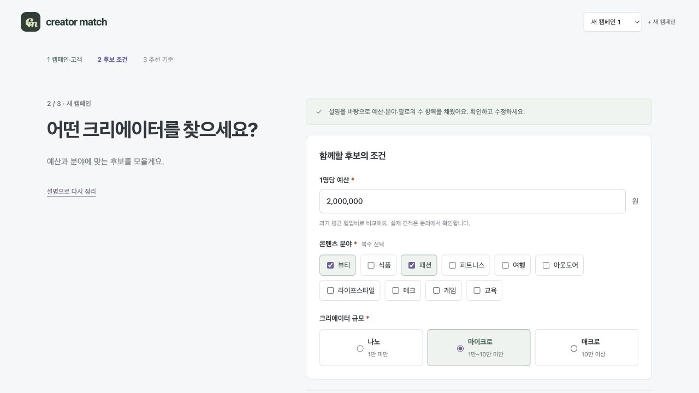

# 화면·데이터·개발 상세 명세

2026-09-23 · 현재 코드 기준. 문제·가설·선택 근거·스토리별 협업 요구는 [PRD](../PRD.md)에, 필드·화면 상태·계산 인터페이스는 이 부록에 둡니다. S00–S10과 AC01–AC13은 두 문서가 공유하는 식별자입니다.

## 1. 화면 및 인터랙션 명세

### S00 · 캠페인 설명

**과업:** 알고 있는 캠페인 정보를 자연어로 전달하거나 직접 입력을 시작합니다.

왼쪽은 서비스 안내, 오른쪽은 설명 입력과 다음 행동입니다. 설명은 최대 1,500자이며 비어 있으면 초안 만들기를 실행할 수 없습니다. **캠페인 초안 만들기**는 현재 로컬 규칙으로 명시된 항목을 추출한 뒤 S01로 이동합니다. 약 0.9초의 처리 상태는 실제 모델 응답 시간과 무관합니다.

추출된 예산·분야·규모는 다음 단계에서 확인합니다. 문장에 없는 필수 조건을 임의로 확정하지 않으며 총예산을 1명당 예산으로 바꾸지 않습니다. 직접 입력은 설명을 건너뜁니다. 재정리에서는 사용자가 직접 정한 이름·비중을 우선합니다.

**완료 조건:** 추출값이 수정 가능한 입력으로 전달되고, 부족한 정보는 이후 단계에서 요청합니다.

### S01 · 캠페인과 고객

**과업:** 무엇을 누구에게 소개하는지 확인합니다.

| 입력 | 필수·제한 | 사용하는 곳 |
|---|---|---|
| 캠페인명 | 필수, 80자 | 캠페인 구분·문의 |
| 제품과 알리고 싶은 점 | 필수, 1,500자 | 적합 설명·제작 제안·문의 |
| 소개하고 싶은 고객 | 선택, 300자 | 적합 분석의 캠페인 맥락 |
| 캠페인 목표 | 필수 선택, 시작값 제품 알리기 | 추천 기준의 시작 프리셋 |
| 표현 방식·꼭 담을 내용 | 선택, 각 500자, 접어서 제공 | 콘텐츠 검토·문의 |
| 고객이 제품을 고를 때 중요한 점 | 선택, 제공 선택지 또는 미정 | 제작 제안·문의 방향 |

다음 버튼에서 현재 단계의 필수값을 검증하고 첫 오류로 초점을 옮깁니다. 고객을 모르더라도 진행할 수 있습니다. 입력한 고객을 실제 크리에이터 시청자 구성으로 간주하지 않습니다. 목표 변경은 아직 직접 정하지 않은 추천 기준에만 반영합니다.

### S02 · 후보 조건

**과업:** 함께할 수 있는 후보의 범위를 정합니다. 세 단계 모두 왼쪽 안내·오른쪽 입력 배치를 유지합니다.

| 입력 | 동작·검증 | 판정 |
|---|---|---|
| 1명당 예산 * | 쉼표 자동 표시·붙여넣기 허용, 원 단위 양의 안전 정수 | 과거 평균 비용 ≤ 예산 |
| 콘텐츠 분야 * | 제공된 10개 중 1개 이상, 복수 선택 | 선택 분야 중 하나와 일치 |
| 크리에이터 규모 * | 나노·마이크로·매크로 중 하나 | 나노 <1만 / 마이크로 1만–10만 미만 / 매크로 ≥10만 |

빈 값·0·음수·소수 원화·지수 표기·안전 정수 범위 초과는 오류입니다. 규모 구간은 이 제품의 운영 정의입니다. 예산 옆에는 실제 견적이 문의에서 확인된다는 설명을 둡니다.

이전으로 이동해도 입력을 유지합니다. 기존 캠페인 편집을 취소하면 적용된 조건과 결과를 유지합니다. 미확정 온보딩 입력의 새로고침 복구는 지원하지 않습니다.

### S03 · 추천 기준 확인

**과업:** 어떤 지표를 우선할지 선택한 뒤 추천을 시작합니다.

- 참여율 우선·조회수 우선·협업 이력 우선·균등 비교 중 선택합니다. 목표별 시작값은 [PRD의 추천 기준](../PRD.md#4-추천-로직을-선택한-이유)에 정의합니다.
- 슬라이더·숫자 입력으로 각 비중을 0–100% 정수로 조절합니다. 한 항목을 바꾸면 나머지를 배분해 합계 100%를 유지합니다.
- 키보드·드래그를 지원합니다. 입력 초안은 최종 적용 전 기존 결과를 바꾸지 않습니다.
- 추천 버튼에서 S01–S03 입력을 확정·저장하고 S04로 이동합니다. 약 4.2초의 단계 안내를 보여주며 실제 데이터·계산 준비 상태는 별도로 처리합니다.

**완료 조건:** 적용할 비중과 합100이 보이고, 수동값이 목표 변경으로 사라지지 않습니다.

### S04 · 추천 목록과 결과 없음

**과업:** 조건을 만족하는 후보를 훑고 다음에 볼 사람을 정합니다.

읽는 순서는 **캠페인 조건 → 적용 기준 → 후보 수 → 주요 지표와 행동**입니다. 이름·플랫폼·분야·팔로워, 살펴볼 콘텐츠, 평균 조회·참여율·협업 건수·평점·과거 협업비를 행 단위로 비교합니다. 플랫폼 아이콘과 분야 태그를 사용하고 내부 ID는 주 정보에서 제외합니다.

| 요소 | 동작 |
|---|---|
| 예산 내 후보 / 견적 필요 | 비용 확인 후보와 미확인 후보를 별도 탭으로 표시 |
| 정렬 | 추천순·참여율·조회수·집행 건수·평점 |
| 목록 길이 | 처음 12명, 더 보기마다 12명 추가 |
| 개별 행동 | 상세, 작은 적합 분석 버튼, 저장, 바로 문의 |
| 조건 변경 | 적용 시 추천순·첫 12명·예산 내 탭으로 돌아옴 |
| 추가 검색 | 플랫폼, 포함·제외 키워드; 확인/자료 필요/제외 구분 |

키워드 검색은 제외어 우선, 포함어 OR/AND를 지원합니다. 자료가 없어 검색어를 확인하지 못한 후보를 부적합으로 단정하지 않습니다. 두 탭의 숫자는 플랫폼을 반영한 후보 수이며 키워드 판정 그룹별 숫자는 별도로 표시합니다. 자료 보유·키워드 일치를 점수에 가산하지 않습니다.

| 빈 상태 원인 | 다음 행동 |
|---|---|
| 분야·규모 조합에 후보 없음 | 조건 변경, 가능한 다른 규모와 인원 |
| 알려진 비용이 모두 예산 초과 | 최소 참고 예산·추가 금액·적용 후 인원 |
| 비용 미확인 후보만 남음 | 견적 필요 탭 이동 |
| 플랫폼·키워드 때문에 보이는 후보 없음 | 해당 조건 해제 또는 자료 필요 그룹 확인 |
| 저장한 후보 없음 | 크리에이터 찾기 이동 |
| 데이터 요청·검증 실패 | 오류 안내와 다시 불러오기 |

조건 완화는 사용자 적용 후 실행합니다. 플랫폼·키워드가 켜진 상태의 대안 인원은 해당 조건도 반영합니다.

### S05 · 추천 기준 변경

S04의 **기준·비중 변경**에서 S03과 같은 조절기를 엽니다. 현재 적용값을 복사하며 취소하면 기존 결과를 유지합니다. 적용하면 추천순·첫 12명으로 정리하되 현재 후보 탭을 유지합니다. 점수와 설명은 새 비중을 함께 참조합니다. 후보 자격은 바뀌지 않습니다.

### S06 · 후보 상세와 캠페인 적합 분석

상세는 CSV 지표와 현재 기준에 따른 후보 특징을 확인하는 곳입니다. 계산 비중·비교 집단은 펼쳐서 읽습니다. 분석 버튼을 누르면 모달에서 로딩 후 다음 순서로 보여줍니다.

1. **적합 문단:** 제품을 어떤 방식으로 소개할 수 있는지, 입력한 고객과 어떤 접점이 있는지.
2. **판단 근거:** 해당 콘텐츠·댓글과 자료 범위.
3. **제작 제안:** 문의에서 논의할 촬영·표현 방식.
4. **확인 질문:** 최근 시청자 구성·제작 조건 등. 선택 질문만 문의에 전달.

원지표 반복 대신 제품 활용안을 검토하고 근거를 확인하도록 한 구성입니다. 자료 없는 후보에게 시청자 특성·댓글 반응을 만들어 주지 않습니다.

기본은 등록 자료와 로컬 규칙을 사용합니다. 모델이 설정된 경우 응답 형식·근거 ID를 검사하고 같은 결과 객체를 화면·리포트·문의에 사용합니다. 설정된 모델의 요청 실패는 재시도 또는 로컬 근거 분석을 사용자가 선택합니다. 닫기·조건 변경 시 이전 요청을 취소합니다. 분석 문장은 추천 점수를 바꾸지 않습니다.

### S07 · 저장과 비교

저장은 다시 볼 후보를 모으는 행동입니다. 저장 수는 제한하지 않고 비교는 2~3명입니다. 2명 미만이면 비교를 시작할 수 없으며 네 번째 선택에는 최대 인원을 안내합니다.

조건이 바뀌어 저장 후보가 범위를 벗어나도 삭제하지 않고 현재 조건과의 차이를 표시합니다. 저장 해제 시 비교·선정 표시는 해제하지만 작성한 협업 기록은 보존합니다. 비교 없이 문의할 수 있습니다.

### S08 · 문의 준비와 보낸 문의

목록·상세·비교·분석에서 진입합니다. 첫 진입 때 후보를 저장하고 문의 초안을 만들며, 기존 문의가 있으면 해당 기록을 엽니다. 분석 제안을 기존 문안에 추가할 때 미리 보기를 거치고 선택 질문만 중복 없이 추가합니다. 기존 문안·견적·진행 상태를 보존합니다.

이메일·채널 URL·제작 범위·일정·사용권·문안을 편집합니다. 편집 중 닫기는 저장·버리기·계속 편집을 선택합니다. 잘못된 입력은 저장하지 않고 해당 필드를 안내합니다.

**현재 ‘문의 보내기’는 문안과 로컬 발송 이력을 저장합니다.** 실제 이메일·DM을 전송하지 않습니다. 문안 복사·메일앱 초안 열기는 발송 완료를 기록하지 않습니다. 외부 연락을 수동 기록할 때만 실제 연락일을 입력합니다. 외부 발송 연결 전에는 동작 이름과 전달 상태를 다시 설계해야 합니다.

### S09 · 협업 관리

| 상태 | 기록할 업무 |
|---|---|
| 문의 준비 | 문의 내용·채널 준비 |
| 답변 대기 | 보낸 문안·답변 확인 |
| 조건 조율 | 받은 견적·제작 범위·사용권 협의 |
| 제작 진행 | 합의 비용·일정 관리 |
| 집행 완료 | 콘텐츠·성과 확인 |
| 진행 안 함 | 종료 사유 |

수동으로 앞뒤 이동하거나 단계를 건너뛸 수 있습니다. 단계별 정보 누락은 보완 안내이며 이동을 막지 않습니다. 입력한 값이 잘못된 경우에는 저장 전에 수정합니다. 목록의 상태 선택은 즉시 저장하고 모달의 변경은 저장에서 확정합니다.

### S10 · 성과 입력과 리포트

**과업:** 후보·캠페인당 최신 누적 기록 하나를 관리합니다.

| 입력·상태 | 규칙 |
|---|---|
| 비용·조회·좋아요·댓글·공유·저장·클릭·구매·매출 | 0 이상의 정수, 공란과 관측된 0 구분 |
| 수치 중 하나라도 입력 | 확인일·출처 필수, * 표시 |
| 구매·매출 입력 | 0을 포함해 집계 기준 필수 |
| 콘텐츠 URL | http/https 허용, 접두사 생략 시 https 보완, 실행 스킴 차단 |
| 저장 성공 | 모달 닫기 → 리포트 갱신 |
| 저장 실패 | 입력 보존·수정할 필드 안내 |

CPV=비용/조회, CPC=비용/클릭, CPA=비용/구매는 필요한 값이 있고 분모가 양수일 때 계산합니다. CPE는 좋아요·댓글·공유·저장 네 값이 모두 필요합니다. 기록 ROAS는 매출/비용×100입니다. 집계 CPV는 비용·조회가 함께 있는 기록끼리 계산하고 포함한 기록 수를 표시합니다.

리포트 예시 데이터는 저장하지 않습니다. 성과 요약은 현재 로컬 규칙이며 최대 8명을 다룹니다. 성과 자동 수집·인과 추정·추천 학습은 연결하지 않았습니다.

## 2. 공통 디자인과 카피

| 먼저 필요한 정보 | 적용한 표현·동작 | 이유 |
|---|---|---|
| 지금 할 일 | 왼쪽 안내·오른쪽 입력, 3단계 고정 | 단계 간 읽는 위치 유지 |
| 조건 의미 | ‘1명당 예산’, 규모 이름과 숫자 구간 | 총예산 오해·업계 용어 장벽 완화 |
| 후보 비교 | 같은 위치에 지표, 아이콘·태그·단위 통일 | 텍스트 덩어리보다 빠른 비교 |
| 기준 변경 | 결과 상단에 현재 기준과 변경 행동 | 하단에서 설명을 찾아야 하는 문제 해소 |
| 적합 이유 | 요청 시 문단→근거→제작 제안 | 같은 일반 주의문 반복 방지 |
| 오류 복구 | 필드 오류·초점, 빈 결과에 수정 행동 | 안내 후 다음 행동 가능 |

주요 행동은 짙은 초록, 분석·보조 선택은 보라입니다. 지표는 참여율 초록·조회수 보라·평점 황토·경험 파랑으로 구분합니다. 선택·오류·자료 부족은 색뿐 아니라 텍스트·체크·아이콘으로 표시합니다.

required 속성과 *를 함께 사용하고 라디오·체크박스·슬라이더는 키보드를 지원합니다. 모달은 제목이 연결된 native dialog입니다. 단계 전환에서는 제목 또는 오류 입력으로 초점을 이동합니다. 데스크톱 주요 경로를 확인했으며 접근성 인증이나 모바일 사용성 검증을 수행한 것은 아닙니다.

## 3. 데이터 사전과 저장 범위

### 원본 11개 필드

| CSV 필드 | 의미·단위 | 사용처 |
|---|---|---|
| creator_id | 유일 식별자 | 안정 정렬·저장 키 |
| creator_name | 제공 이름 | 목록·상세·문의 |
| category | 10개 분야 중 하나 | OR 필터·태그 |
| platform | 유튜브/인스타그램 | 아이콘·검색·비교 집단 |
| followers | 명 | 규모 필터·보조 지표 |
| avg_view_count | 회 | 정규화·원지표·미확인 후보 정렬 |
| engagement_rate | % | 정규화·표시, 7.7은 7.7% |
| total_campaign_count | 건 | 경험·비용 확인 판정 |
| total_campaign_budget_krw | 원 | 상세 누적 정보, 예산 필터 제외 |
| avg_campaign_budget_krw | 원 | 예산 필터·과거 평균 비용 |
| advertiser_rating | 1–5 또는 공란 | 평점 점수·미평가 표시 |

원본 200명의 바이트를 보존합니다. 27명은 집행 0·평균 비용 0·평점 공란입니다. 나머지 173명 모두 평균 비용×건수와 누적액이 정확히 일치하지 않습니다. 원인을 알 수 없어 수정하지 않고 예산 필터에는 제공 평균값을 선택했습니다. [해시·감사](DATA_AUDIT.md)

### 앱에서 생성하는 데이터

| 객체 | 저장 단위 | 원본과의 관계 |
|---|---|---|
| 조건·목표·비중 | 캠페인 | 추천 입력 |
| 저장·비교·메모·선정 | 캠페인×creator_id | 원본 참조 |
| 문의·상태·견적·최신 성과 | 캠페인×creator_id | 사용자 입력, 추천에 자동 반영 없음 |
| 콘텐츠·댓글 | creator_id 공통 | 캠페인 간 공유, 출처·범위 별도 |
| 분석 결과 | 캠페인·비중·자료 기반 캐시 | 화면·내보내기·문의가 동일 결과 참조 |

기본 콘텐츠는 **5명의 편집 예시와 AI 생성 이미지 2개**입니다. 원본에 없는 SNS·댓글·일부 연령 예시를 실제 수집 정보로 취급하지 않습니다. 직접 자료를 처음 등록하면 해당 후보의 편집 예시를 대체하며 CSV·추천 수식은 그대로 유지합니다.

일반 실행은 localStorage, `?demo`는 별도 sessionStorage입니다. 캠페인별 문안·성과를 분리합니다. 저장 공간 오류는 안내하고 메모리 편집 내용을 유지합니다. 계정 동기화·서버 백업·팀 권한은 없습니다.

## 4. 엔지니어링 계약

React·TypeScript·Vite 단일 페이지 앱이며 필수 경로는 브라우저에서 실행합니다.

| 경계 | 계약·구현 |
|---|---|
| CSV → Creator[] | [loadData](../src/loadData.ts)·[domain](../src/domain.ts). 요청·스키마·중복·필수·범위 검사. 잘못된 행을 버리지 않고 전체 오류 |
| 입력 → MatchResult | `recommend(all, input, 'cohort', weights)`. input=budgetKRW·categories·sizeTier. matched·needsQuote·alternatives·제외 요약 반환 |
| 계산 → UI | [useRecommendation](../src/useRecommendation.ts)·[Worker](../src/recommend.worker.ts). 변경 시 이전 작업 정리, 새 결과 반영 |
| 정책 → 화면·설명 | [policy](../src/policy.ts)·[weights](../src/weights.ts)·[matchStory](../src/matchStory.ts). 규모·프리셋·정렬·비중 배분 공유 |
| 분석 → 리포트·문의 | [review](../src/review.ts)·[inquiryProposal](../src/inquiryProposal.ts). 근거·질문·중복 검사 |
| 작업 공간 → 저장 | [workspaces](../src/workspaces.ts)·[WorkspaceApp](../src/WorkspaceApp.tsx). 캠페인별 복원·이전 저장 형식 이전 |

CSV는 앱 시작과 함께 로드됩니다. 온보딩 완료 뒤 요청하는 구조가 아닙니다. 확정 조건과 데이터가 준비되면 계산합니다. 4.2초 안내는 별도 전환이며 서버 진행률이 아닙니다. [데이터와 계산 흐름](../flowchart.md#3-데이터-준비와-추천-계산)

정렬·검색은 점수 비교 집단을 바꾸지 않습니다. 비중은 점수·설명을, 예산·분야·규모는 후보 자격을 바꿉니다. 원본·입력·비중이 같으면 같은 결과를 반환합니다.

### 선택적 AI 연결

온보딩 문장 정리·문의 문안·성과 요약은 로컬 규칙입니다. 검색·후보 분석에는 서버 모델 연결 경로가 있습니다. 키 없이 기본 사용이 가능하며 실제 모델 응답·비용·지연은 이번 환경에서 검증하지 않았습니다.

키는 서버 환경변수에만 두고 브라우저에 전달하지 않습니다. 모델은 제공 근거로 설명하며 순위를 수정할 수 없습니다. 근거 ID·구조 검사가 내용의 사실성까지 보장하지는 않습니다. 정적 호스팅에 로컬 서버 기능이 자동 포함되지 않습니다.

## 5. 기능 수용 기준

| ID·스토리 | Given → When → Then | 증거 |
|---|---|---|
| AC01·US01 | 예산 없는 설명 → 초안 → 예산 미확정, 입력 후 진행 | setup.test.ts |
| AC02·US01 | 수동 이름·비중 → 재정리/목표 변경 → 수동값 유지 | setup.test.ts, 브라우저 |
| AC03·US02 | 비용과 동일 예산 → 추천 → 포함; 1원 낮으면 제외 | domain.test.ts |
| AC04·US02 | 9,999/10,000/99,999/100,000 → 규모 → 정확한 한 구간 | domain.test.ts |
| AC05·US02 | 뷰티·패션 → 추천 → OR·중복 없음·27명 무료 처리 없음 | domain.test.ts |
| AC06·US03 | 같은 후보 → 비중만 변경 → 자격 유지·합100·순위/설명 변경 | weights.test.ts, matchStory.test.ts, 브라우저 |
| AC07·US04 | 예시 1원 → 540,000원 적용 → 소라TV177 한 명 | domain.test.ts, 브라우저 |
| AC08·US04 | CSV 실패 → 다시 불러오기 → 정상 응답 복구 | experience.test.ts |
| AC09·US05 | 자료 없음 → 분석/검색 → 없는 근거·타깃 생성 없음 | review.test.ts, searchPolicy.test.ts |
| AC10·US06 | 기존 문의 → 질문 추가 → 문안·상태 보존·중복 없음 | review.test.ts, 브라우저 |
| AC11·US07 | 구매 0·출처 없음 → 저장 → 출처·확인일·집계 기준 요구 | campaign.test.ts |
| AC12·US07 | 유효 성과 → 저장 → 모달 닫힘·리포트 갱신·0/공란 구분 | campaign.test.ts, 단일 캠페인 브라우저 |
| AC13·US08 | 같은 후보·두 캠페인 → 전환/새로고침 → 문안·상태 복원 | experience.test.ts 등, 브라우저 |

200개 자동 테스트·타입 검사·빌드를 통과했습니다. 별도 빈 폴더에서 기존 npm 캐시로 설치·검사했습니다. 새 OS 검증과 다릅니다. 상세는 [QA](QA.md), 원문 연결은 [요구사항 추적표](REQUIREMENTS.md)에 있습니다.

실제 사용자 이해도, 모델 응답 품질, 두 캠페인의 성과 입력 전체 브라우저 경로, 다운로드 완료는 남은 검증입니다. 인터뷰·시간 단축·광고 성과 개선율을 측정한 것으로 쓰지 않습니다.

