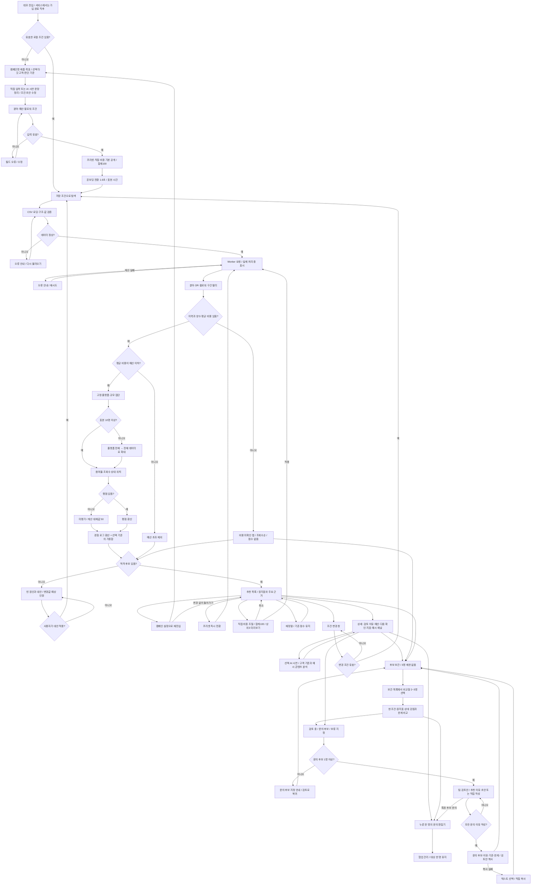
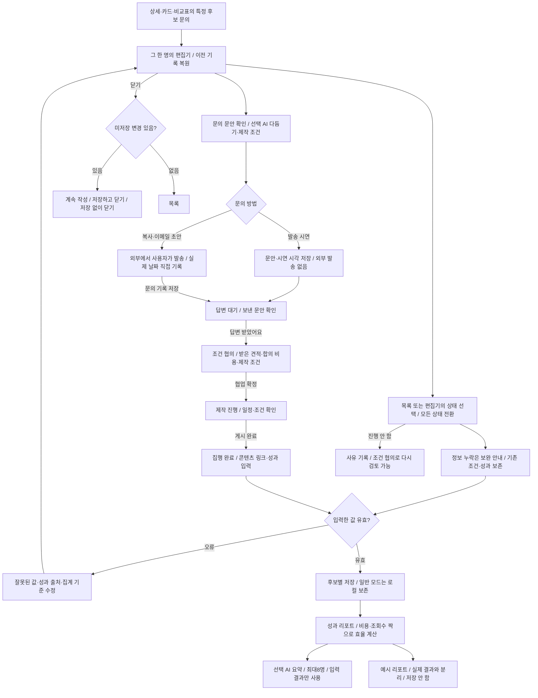
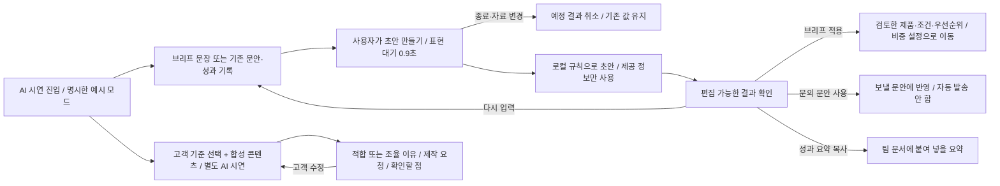

# 사용자 여정과 추천 흐름

정책은 [PRD](PRD.md), 사용자 피드백과 정보 구조는 [UX 검토](docs/UX_REVIEW.md), 계산은 `src/domain.ts`, 화면은 `src/App.tsx`에 연결된다.

CSV 요청은 앱이 열릴 때 시작한다. 차트는 사용자가 마주하는 단계와 논리 분기를 표현한다. 기준 변경은 필터를 바꾸지 않고 점수·설명을 재계산한다. 재정렬만 바꾸면 점수는 유지되며 선택 지표 내림차순·동점 ID순이다. 조건 변경·대안 적용 후에는 추천순으로 돌아간다. 가격 미확인 후보에는 점수를 노출하지 않는다.

보관 목록·비교 선택·문의/보류 상태·메모·사용자 비중은 조건 변경과 재방문에도 보존한다. 후보를 빼면 비교 선택과 판단 상태에서도 제외한다. 문의 버튼은 상세·카드·비교표에서 특정한 한 명의 편집기로 바로 이동한다. 팀 검토안은 선택 경로다. 네 번째 비교 선택은 기존 세 명을 유지하고 안내한다. 기준 안내 모달은 임시 선택 → 적용으로 동작하며 취소하면 기존 기준을 유지한다. 상단 빠른 전환은 즉시 적용한다.

가입·로그인·자동 문의 발송은 구현 범위 밖이다. 문의 초안과 수동 진행·성과 기록은 아래 흐름으로 제공한다. 모달은 닫기·Escape로 원래 화면에 돌아온다. 저장 오류가 나도 현재 탐색을 계속할 수 있다.

## 협업·성과 기록

복사·메일 초안 열기는 연락 상태를 바꾸지 않는다. 시연 발송은 명시한 로컬 체험이며 실제 문의 날짜를 생성하지 않는다. 목록의 상태 선택은 즉시 저장, 편집기의 선택은 저장 버튼으로 반영한다. 누락된 제작 조건은 상태 기록을 막지 않지만 입력 형식·성과 출처 검증은 유지한다. 성과는 CSV·추천 점수에 합치지 않으며, 단일 콘텐츠의 최신 누적 기록이다.

## AI 시연의 사용자 흐름

기본 화면은 실제 모델을 호출하지 않는다. 브리프 시연은 사용자가 검토한 조건을 명시적으로 적용하며 이후 순위는 추천 함수가 계산한다. 내부 선정 이유는 팀 검토안에 보존하고 외부 문의 문안에 자동 포함하지 않는다. 실제 API 연결 코드는 별도 개발용이며 시연과 구분한다. `?demo`는 저장하지 않는 독립 체험이다. 결제·팀 권한·복수 캠페인은 향후 범위다.
