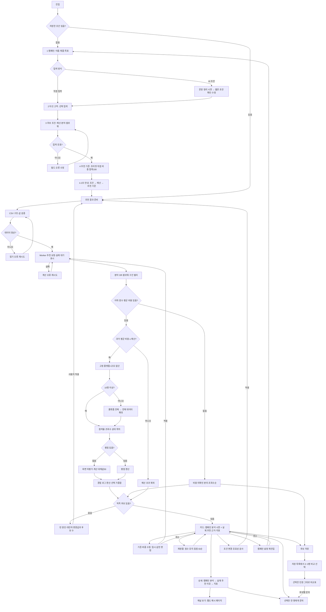
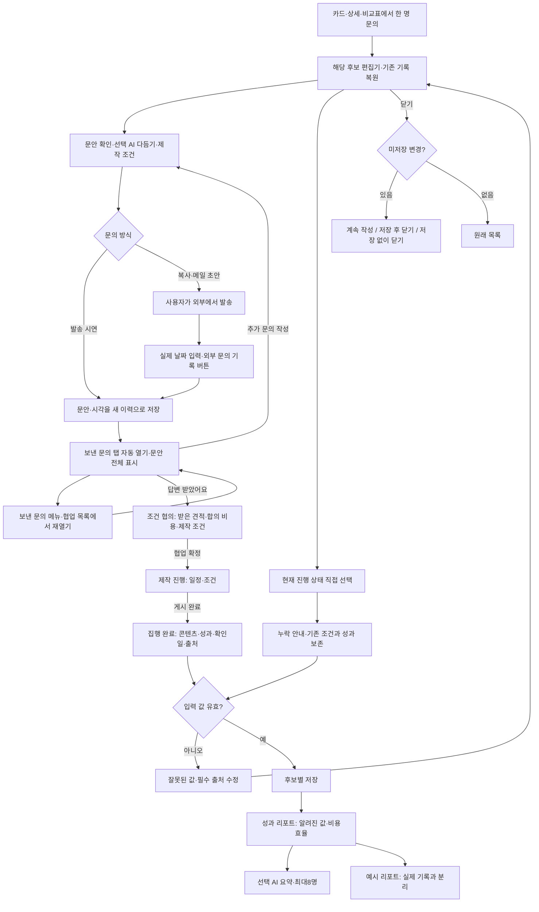
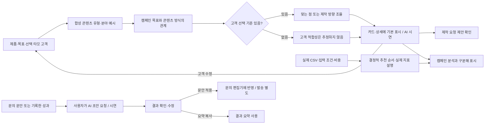

# 사용자 여정과 추천 흐름

현재 8차 기준(2026-09-22). 정책은 [PRD](PRD.md), 화면별 판단은 [제품 전체 검토](docs/PRODUCT_UX_AUDIT.md)에 연결한다.

CSV는 앱 진입 시 병렬로 불러온다. 위 차트는 논리 분기와 사용자 동선을 설명한다. 4.2초는 입력 조건과 절차를 읽는 **표현 시간**이며 실제 처리율이 아니다. 일반 필터 변경에는 이 지연을 넣지 않는다. 실제 로딩·Worker 오류는 별도 처리한다.

비중 변경 전에는 결과가 바뀌지 않으며 적용 전 순위 미리보기는 없다. 조건 변경·대안 적용 후에는 추천순으로 돌아간다. 비용 미확인 후보는 무료로 취급하거나 예산 충족을 보장하지 않는다. 분석 시연은 점수에 개입하지 않는다. 팀 검토안·문의 후보 별도 지정 단계는 없다.

## 문의와 협업·성과

첫 문의 시연은 답변 대기로 바꾸고 실제 문의 날짜를 만들지 않는다. 추가 문의는 기존 협업 상태를 유지한다. 날짜를 편집하거나 진행 상태만 바꾸는 행위는 새 발송이 아니다. 시연·외부 직접 기록을 구분하며 이전 문안은 재발송 후에도 보존한다. 메뉴 숫자는 발송 건수다. 실제 외부 발송·배달 확인은 구현하지 않았다.

목록의 상태 선택은 즉시 저장하고 편집기의 상태 선택은 저장 후 반영한다. 자료가 아직 없어도 현실의 진행 상태를 기록할 수 있지만, 잘못 입력한 값과 성과 출처 누락은 저장을 막는다. 성과는 CSV와 추천 점수에 합치지 않는다.

## 캠페인 분석과 AI 적용

캠페인 분석은 버튼 뒤에 숨기지 않고 자동 표시하며 추가 대기를 넣지 않는다. 합성 콘텐츠는 실제 크리에이터의 최근 게시물·시청자 정보가 아니다. 브리프·문의·성과 시연은 사용자가 결과를 확인하고 적용한다. 실제 모델 호출과 별개인 로컬 규칙이다. `?demo`는 저장하지 않는 독립 체험이다.
