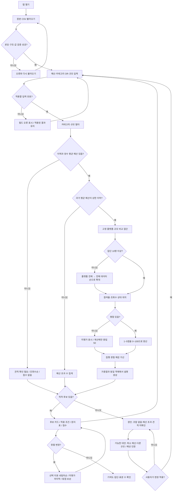

# 추천 흐름

정책: [PRD](PRD.md). 계산: `src/domain.ts`. 화면: `src/App.tsx`.

필터 변경은 적용 버튼 이후 반영된다. 대안은 사용자 클릭으로만 적용한다. 견적 미확인 후보는 적격 추천과 별도로 항상 확인할 수 있다. 점수 집단은 적용 후보가 아닌 전체 원본 기준이다.

입력/로딩/결측 등 예외 정책의 실제 검증 상태는 [QA](docs/QA.md)에 기록한다.

