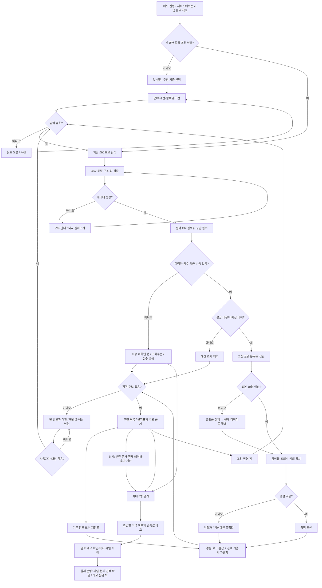

# 사용자 여정과 추천 흐름

정책은 [PRD](PRD.md), 사용자 피드백과 정보 구조는 [UX 검토](docs/UX_REVIEW.md), 계산은 `src/domain.ts`, 화면은 `src/App.tsx`에 연결된다.

CSV 요청은 앱이 열릴 때 시작한다. 차트는 사용자가 마주하는 단계와 논리 분기를 표현한다. 기준 변경은 필터를 바꾸지 않고 점수·설명을 재계산한다. 재정렬만 바꾸면 점수는 유지되며 선택 지표 내림차순·동점 ID순이다. 조건 변경·대안 적용 후에는 추천순으로 돌아간다. 가격 미확인 후보에는 점수를 노출하지 않는다.

가입·로그인·외부 문의는 구현 범위 밖이며 실제로 수행하는 것처럼 표시하지 않는다. 모달은 닫기·Escape로 원래 화면에 돌아온다. 저장 오류가 나도 현재 탐색을 계속할 수 있다.
