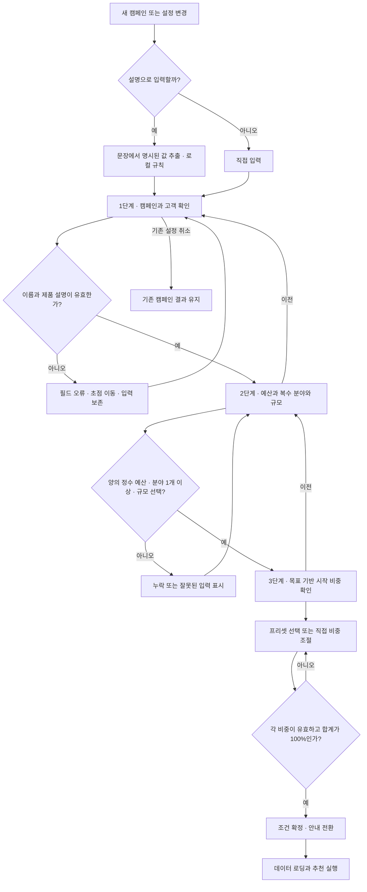
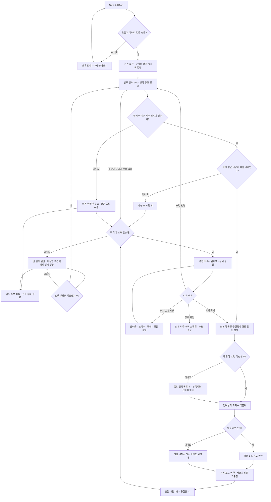
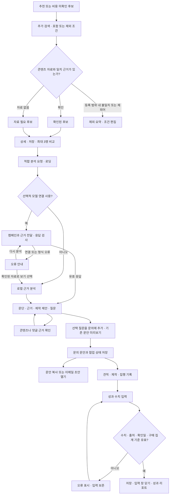

# 입력부터 추천까지의 흐름

현행 [PRD](PRD.md)와 코드 기준입니다. 첫 번째와 두 번째 그림이 핵심 추천이며, 세 번째는 선택 기능입니다.

## 1. 캠페인 입력과 검증

명시하지 않은 예산·분야·규모는 임의 확정하지 않습니다. 직접 설정한 이름·비중은 재정리보다 우선합니다. 세 단계 모두 같은 좌우 배치를 사용합니다.

## 2. 데이터 처리·점수·결과 복구

점수 기준 집단은 필터 전 원본으로 고정합니다. 공란 평점의 계산 분기는 향후 데이터까지 처리하지만, 현재 원본의 공란 27명은 모두 비용 미확인 분기로 이동합니다. 최소 예산·다른 규모를 제안할 때에도 사용자의 적용 없이 조건을 바꾸지 않습니다.

## 3. 선택 경로: 콘텐츠 근거부터 문의·성과까지

문의 기록은 로컬 상태이며 외부 발송이 아닙니다. 성과는 수동 관측 기록이고 추천 점수로 환류하지 않습니다. 키워드·콘텐츠 자료 보유 여부도 원본 추천 점수에 가산하지 않습니다.
