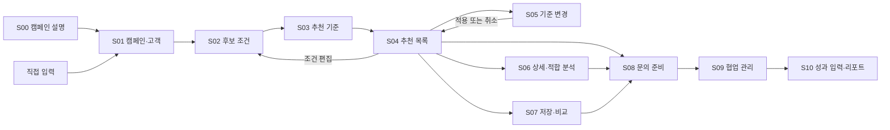
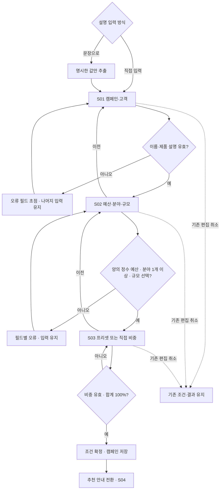
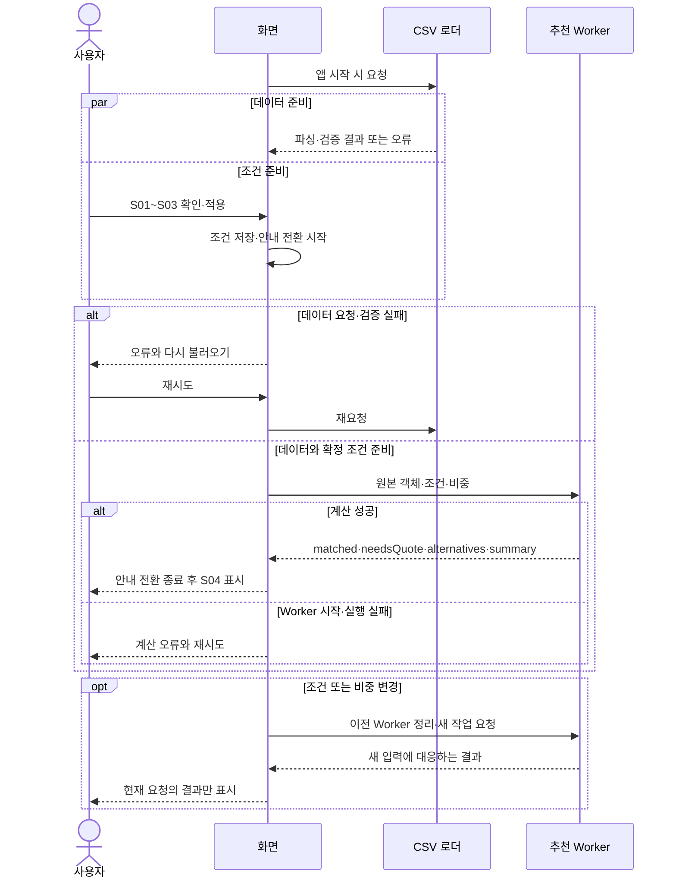
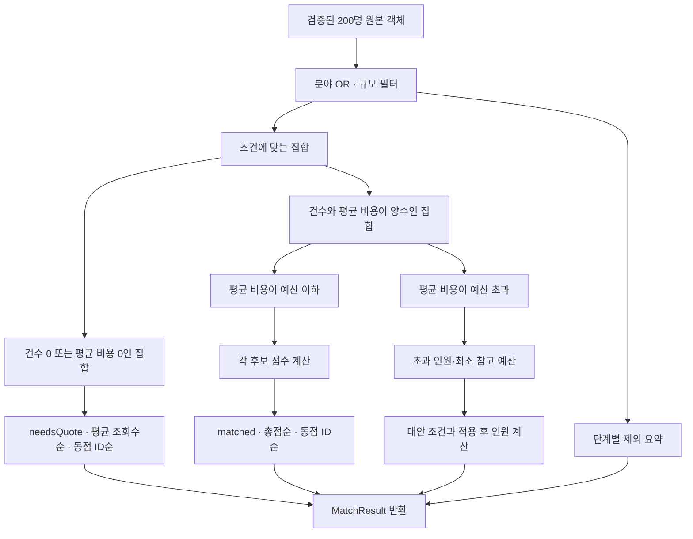
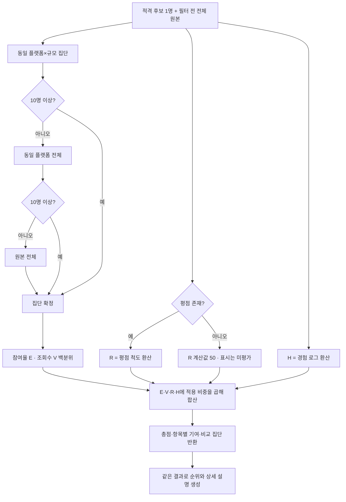
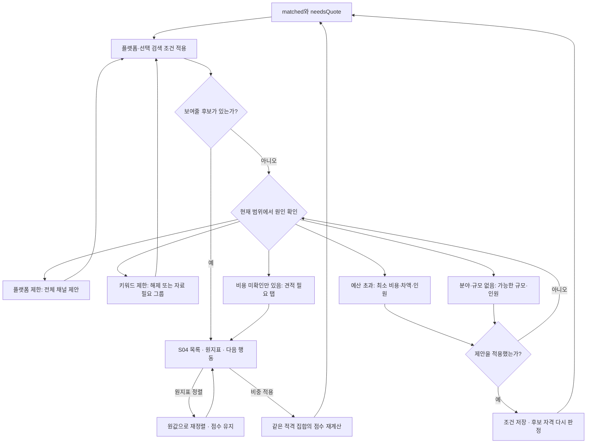
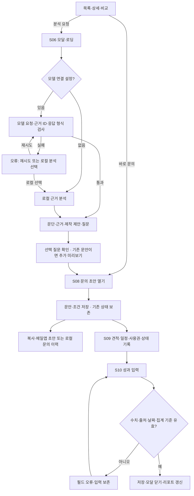

# Creator Match · 사용자 흐름과 추천 처리

[PRD](PRD.md)의 화면 ID를 사용합니다. **① 어디로 이동하는지 → ② 입력을 어떻게 확정하는지 → ③ 언제 계산하는지 → ④ 어떻게 추천하는지 → ⑤ 결과가 없으면 무엇을 하는지 → ⑥ 협업을 어떻게 기록하는지**를 나누었습니다.

## 1. 전체 화면 흐름

실선은 이동 가능한 경로입니다. 상세·비교·분석을 모두 거쳐야 문의할 수 있다는 의미가 아닙니다.

S06·S07은 닫기 또는 찾기 메뉴로 목록에 돌아옵니다. 왼쪽 메뉴에서는 저장·보낸 문의·협업·리포트로 직접 이동할 수 있습니다. S10은 집행 완료 단계에서만 열리는 기능이 아닙니다.

## 2. 입력 확정과 보존

아래는 새 캠페인의 시작 경로입니다. 기존 캠페인 편집은 현재 값을 초안으로 복사하고 취소 시 적용값을 유지합니다.

추출은 현재 로컬 규칙입니다. 입력하지 않은 필수 조건을 기본값으로 확정하지 않으며 수동 이름·비중은 재정리보다 우선합니다. 이전 이동의 입력 보존과 새로고침 복구는 다릅니다. 미확정 초안은 새로고침으로 유실될 수 있습니다.

## 3. 데이터 준비와 추천 계산

CSV 로딩은 온보딩과 동시에 시작됩니다. 4.2초의 안내 전환을 실제 서버 진행률로 표현하지 않습니다.

오류 상태는 다시 시도해 복구하며, 로딩 중 이전 결과를 새 조건의 결과로 보여주지 않습니다. 모델 호출은 이 추천 계산에 포함되지 않습니다.

## 4. 후보 판정과 점수 계산

첫 그림은 **후보 집합을 분리하는 과정**, 두 번째는 **적격 후보 한 명의 점수 계산**입니다. 분기된 후보를 한 명씩 ‘결과 없음’으로 판정하지 않고 전체 집합을 만든 뒤 결과 화면이 판단합니다.

현재 평점 공란 27명은 모두 needsQuote로 분리되므로 점수 그림의 공란 분기를 통과하지 않습니다. 향후 유료·미평가 후보까지 처리하는 방어 분기입니다. 비중·수식·단일 집단·동점 정책은 [PRD §6](PRD.md#6-추천-로직과-설계-근거)을 따릅니다.

## 5. 목록·검색·빈 결과 복구

플랫폼·키워드는 추천 이후의 표시 범위를 좁힙니다. 비중은 점수를, 예산·분야·규모는 후보 자격을 바꿉니다.

자료가 없는 경우와 등록 자료에서 검색어가 확인되지 않은 경우를 구분합니다. 제외어 일치가 우선하고 포함어는 OR/AND에 따라 판정합니다. 원본 추천 점수에는 검색어·자료 보유 가산이 없습니다. 제안의 인원도 현재 검색 범위를 반영합니다.

## 6. 분석에서 문의·성과로 이어지는 선택 경로

분석을 생략하고 바로 문의할 수 있습니다. 분석 결과·근거·선택 질문은 하나의 검토 객체를 공유합니다.

협업 상태는 아래와 같은 일반 순서로 정리했지만 **현재 구현은 수동 자유 이동**입니다. 단계 누락이 전이를 막지 않고, 상태를 되돌려도 기록을 삭제하지 않습니다.

| 현재 상태 | 대표 다음 상태 | 부작용·보존 |
|---|---|---|
| 문의 준비 | 답변 대기 | 로컬 문의 기록 시 초안 상태만 이동, 실제 연락일 생성 없음 |
| 답변 대기 | 조건 조율 | 받은 견적·문안 보존 |
| 조건 조율 | 제작 진행 | 합의 비용·일정·사용권 보존 |
| 제작 진행 | 집행 완료 | 수동 상태 변경, 성과 필수 제출 없음 |
| 모든 상태 | 진행 안 함 또는 다른 상태 | 기존 기록 보존, 종료 사유 입력 가능 |

성과는 수동 관측값이며 추천 점수로 환류하지 않습니다. 빈 값은 미확인, 0은 관측된 0입니다. 저장 성공과 외부 발송 성공도 서로 다른 상태입니다.
